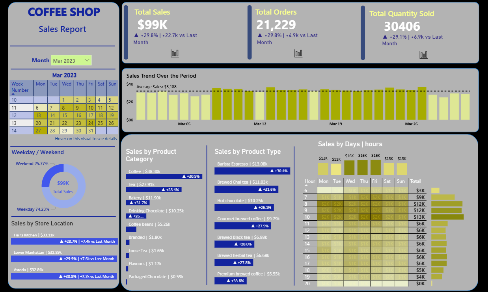

# PowerBI_Coffee_Sales_Dashboard
Refer to this link for Video Explanation(Usage of headphones will provide proper volume):

 https://www.loom.com/share/a50775e173734e159f3415f01bfa2eab?sid=8d02b398-3dfb-438f-9b61-4edbb494e890

OBJECTIVE:
The objective of creating this dashboard is to analyze the coffee shop's sales performance over a period of 6 months.
I have broken down the objective by analyzing sales on an hourly basis, by store location, by product category, and by weekend vs. weekday sales.

KEY-INSIGHTS:
The month of June recorded the highest sales, number of orders, and quantity sold.

In every month, sales for about 16–17 days are above the monthly average, while the rest fall below, indicating that sales are not significantly skewed within a month.

The first 7 days and the last 3 days of almost every month show below-average sales.

Hell's Kitchen was the top-selling store in all months.

Weekends contribute roughly one-fourth to one-third of total monthly sales.

Coffee, followed by Tea, was the highest-selling product category throughout.

POWERBI TECHNIQUES:
Imported data from PostgreSQL.

Created a date table, extracted new columns from existing ones, and built new measures using DAX.

Focused on KPIs using the Card visual.

Applied custom formatting, sparkline visuals, calendar formatting, and slicer implementation.

Customized tooltips.

Edited visual interactions.

END NOTE:
My dashboard emphasizes simplicity—despite offering granular analysis, it can be easily understood by individuals across departments and domains.
Management can identify "cold hours"—periods with typically low sales—which can be targeted with discounts, special offers, or product bundles.

FUTURE WORK:
Next, I plan to explore importing data from a NoSQL database, performing What-If analysis, and building a mobile-optimized layout.

